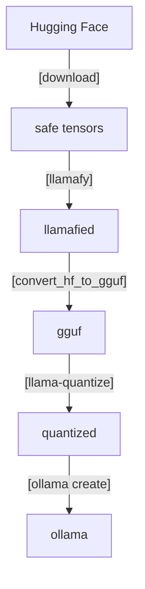

# hf2ollama

```mermaid
graph TD;
  A[Hugging Face] --[download]--> B[safe tensors];
  B --[llamafy]--> C[llamafied];
  C --[convert_hf_to_gguf]--> D[gguf];
  D --[llama-quantize]--> E[quantized];
  E --[ollama create]--> F[ollama];
```
