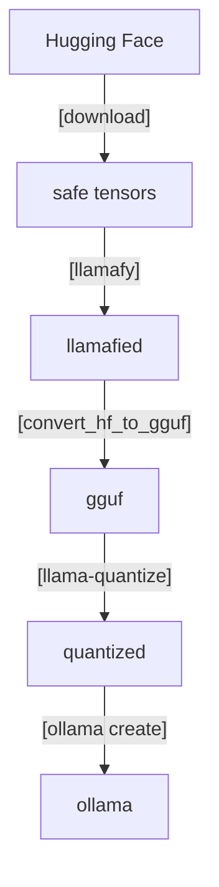

# hf2ollama

Environment Variables
---------------------
* HF_MODEL_ID          : Hugging Face Model ID (default: LGAI-EXAONE/EXAONE-3.0-7.8B-Instruct)
* QUANTIZE_METHOD      : Quantize method (default: Q4_K_M)
* OLLAMA_MODEL         : Ollama model name (default: exaone3)
* OLLAMA_HOST          : Ollama host url (default: http://localhost:11434)

Targets
-------
* make build           : Build a docker image for building
* make download        : Download the official model from Hugging Face
* make llamafy         : Llamafy the official model
* make convert         : Convert the Llamafied model to a gguf model
* make quantize        : Quantize the gguf model
* make create          : Create a model that can be used in Ollama
* make run             : Run Ollama CLI
* make clean           : Delete the docker images for building
* make distclean       : Delete the docker images for building and all the files generated

