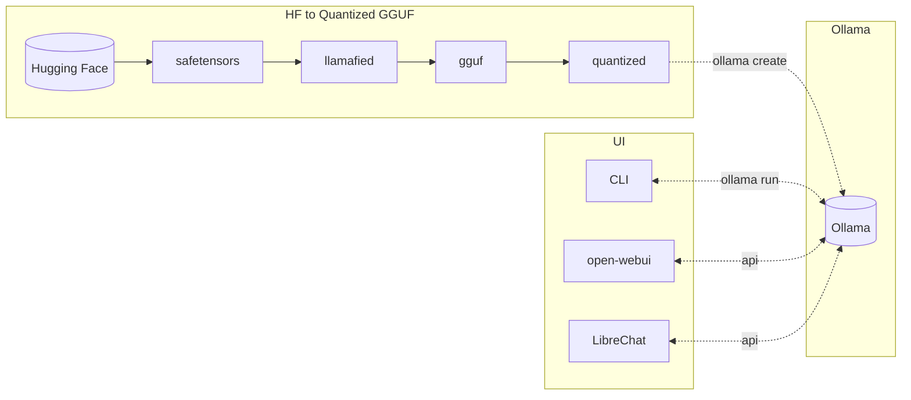

# hf2ollama
This project was initiated with the goal of converting and quantizing the EXAONE3 model for use in Ollama. Currently, other models are also being included for performance comparison purposes.

Flowchart
---------

Environment Variables
---------------------
* HF_MODEL_ID          : Hugging Face Model ID (default: LGAI-EXAONE/EXAONE-3.0-7.8B-Instruct)
* QUANTIZE_METHOD      : Quantize method (default: Q4_K_M)
* OLLAMA_MODEL         : Ollama model name (default: LGAI-EXAONE_EXAONE-3.0-7.8B-Instruct)
* OLLAMA_HOST          : Ollama host url (default: http://localhost:11434)

Targets
-------
* make build           : Build a docker image for building
* make download        : Download the official model from Hugging Face
* make llamafy         : Llamafy the official model
* make convert         : Convert the Llamafied model to a gguf model
* make quantize        : Quantize the gguf model
* make create          : Create a model that can be used in Ollama
* make run             : Run Ollama CLI

Development Targets
-------------------
* make readme          : Update README.md
* make shell           : Run a shell of the docker image for build
* make ollama-shell    : Run a shell of the Ollama docker image
* make clean           : Delete the docker images for building
* make distclean       : Delete the docker images for building and all the files generated

Tested Models
-------------
* https://huggingface.co/LGAI-EXAONE/EXAONE-3.0-7.8B-Instruct
* https://huggingface.co/MLP-KTLim/llama-3-Korean-Bllossom-8B
* https://huggingface.co/yanolja/EEVE-Korean-Instruct-10.8B-v1.0
* https://huggingface.co/rtzr/ko-gemma-2-9b-it
* https://huggingface.co/mistralai/Mixtral-8x7B-Instruct-v0.1

References
----------
* https://huggingface.co/maywell/EXAONE-3.0-7.8B-Instruct-Llamafied
* https://github.com/ggerganov/llama.cpp
* https://github.com/ollama/ollama
* https://github.com/open-webui/open-webui
* https://github.com/danny-avila/LibreChat
