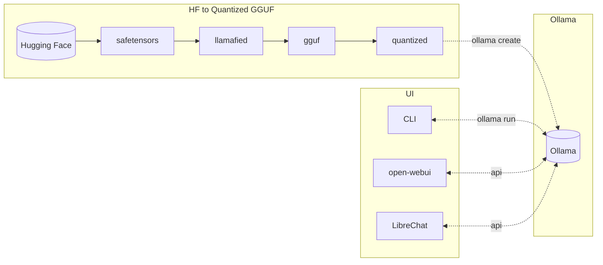

```mermaid
graph LR
  subgraph HF to Quantized GGUF
    A[(Hugging Face)]-->B[safetensors]-->C[llamafied]-->D[gguf]-->E[quantized]
  end
  subgraph Ollama
    E-. ollama create .->I[(Ollama)]
  end
  subgraph UI
    J[CLI]<-. ollama run .->I
    K[open-webui]<-. api .->I
    L[LibreChat]<-. api .->I
  end
```
